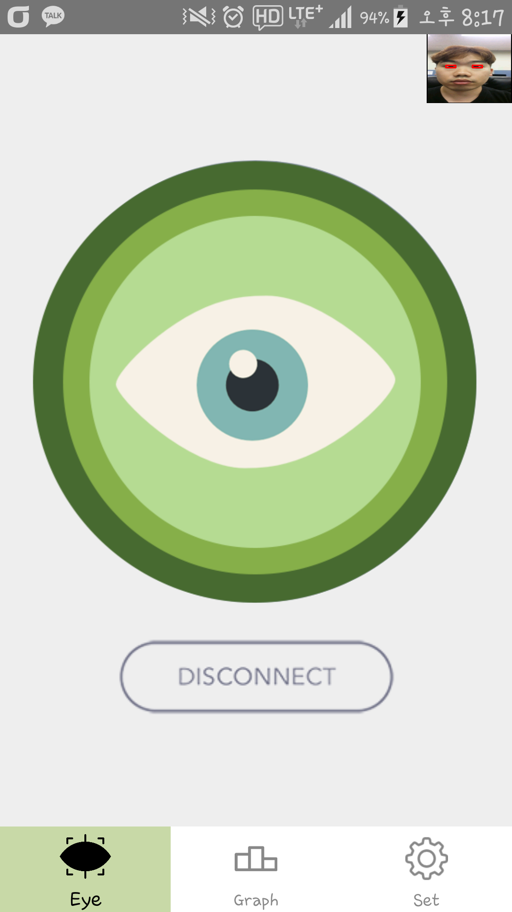
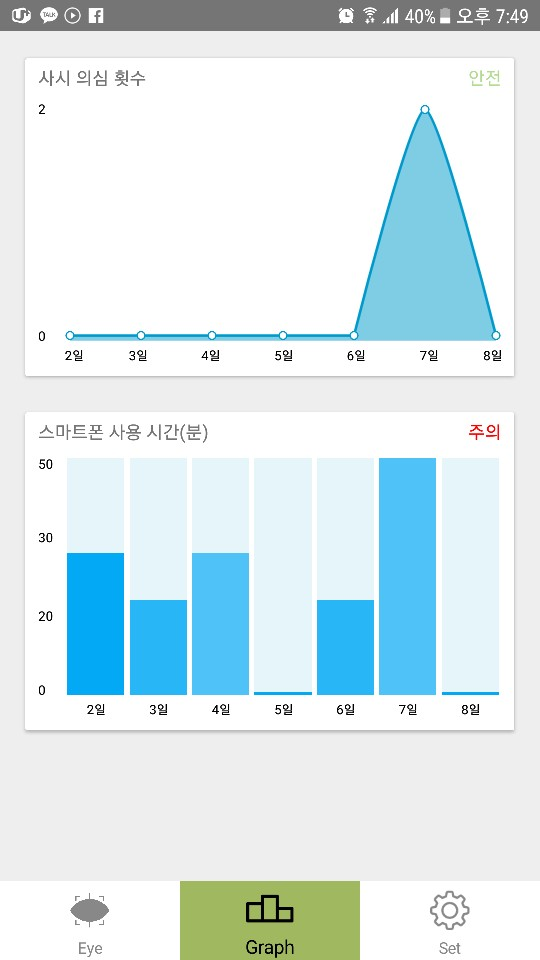

Doublei (더블아이)
=

## 1. 프로젝트 소개
- 영유아 사시 진단 애플리케이션

## 2. 기획 의도
- 사시란 두 눈이 정렬되지 않고 서로 다른 지점을 바라보는 시력 장애입니다.
- 전 세계적으로 3억 명이 사시를 앓고 있으며 10대 이하의 사시 환자 수는 84.9%에 달합니다.
- 갑자기 일시적으로 한쪽 눈 또는 양쪽 눈이 바깥으로 빠지는 간헐적 사시를 조기에 발견하여 치료를 받게 하는 것입니다.

## 3. 주요 기능
> #### 1. 백그라운드 서비스
> #### 2. 전면 카메라를 통한 사시 진단
> #### 3. 얼굴과 스마트폰의 거리 유지
> #### 4. 그래프를 통한 데이터 시각화

## 4. 애플리케이션 이미지
 >>>  >>> 

## 5. 기대 효과
- 영유아 사시를 조기에 발견하여 병원으로 유도하고 사시 치료를 받게 하여 치료 확률을 높일 수 있습니다.

## 6. 수상내역
- 제29회 글로벌SW공모대전 은상(과학기술정보통신부 장관상) 수상
